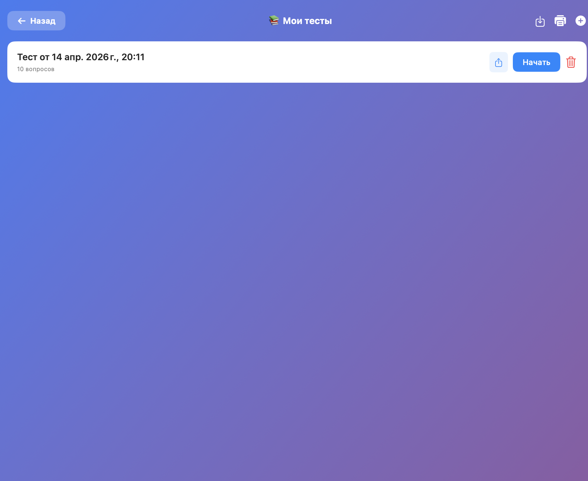
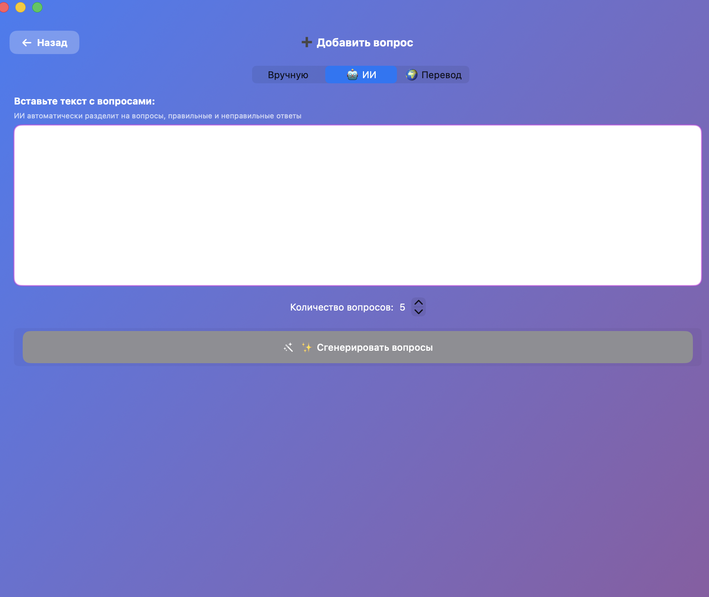
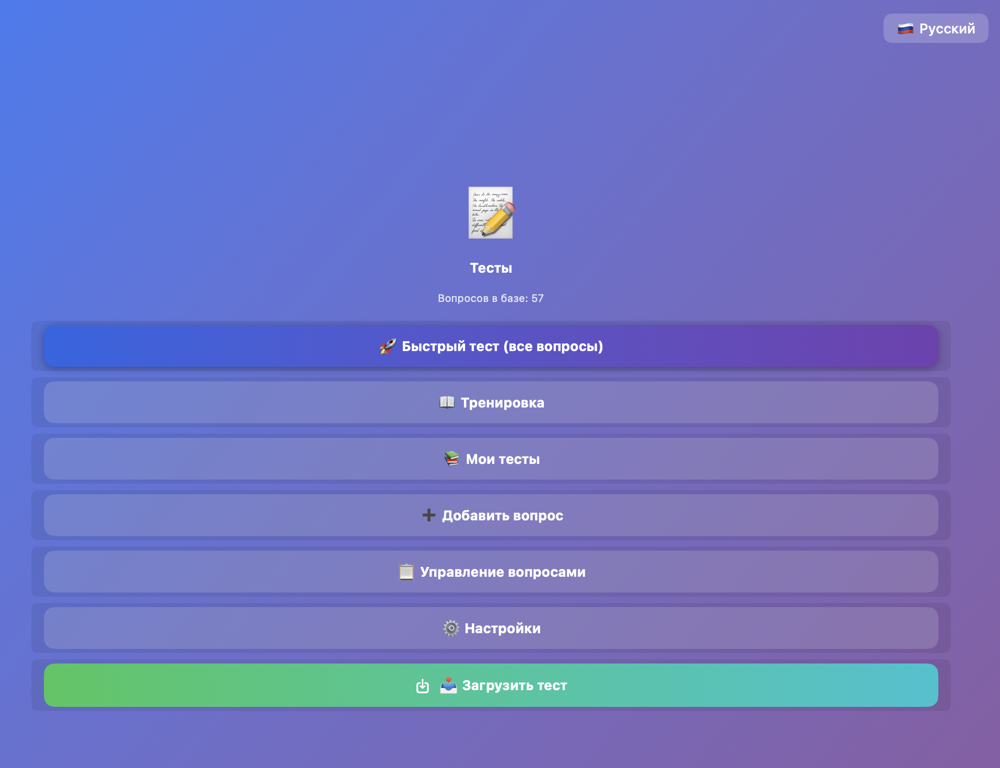
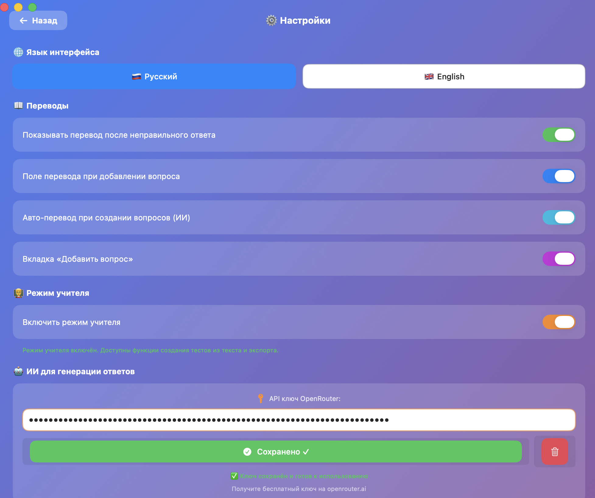
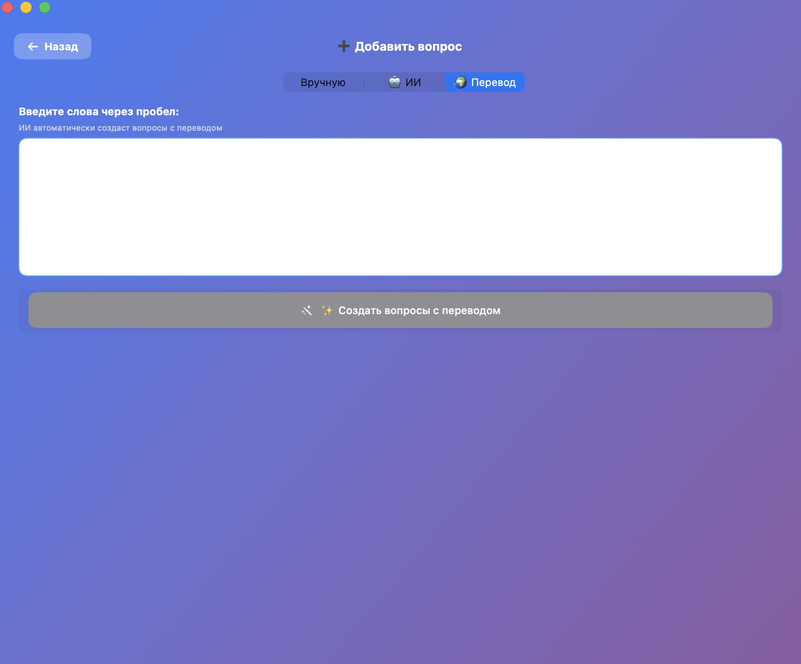
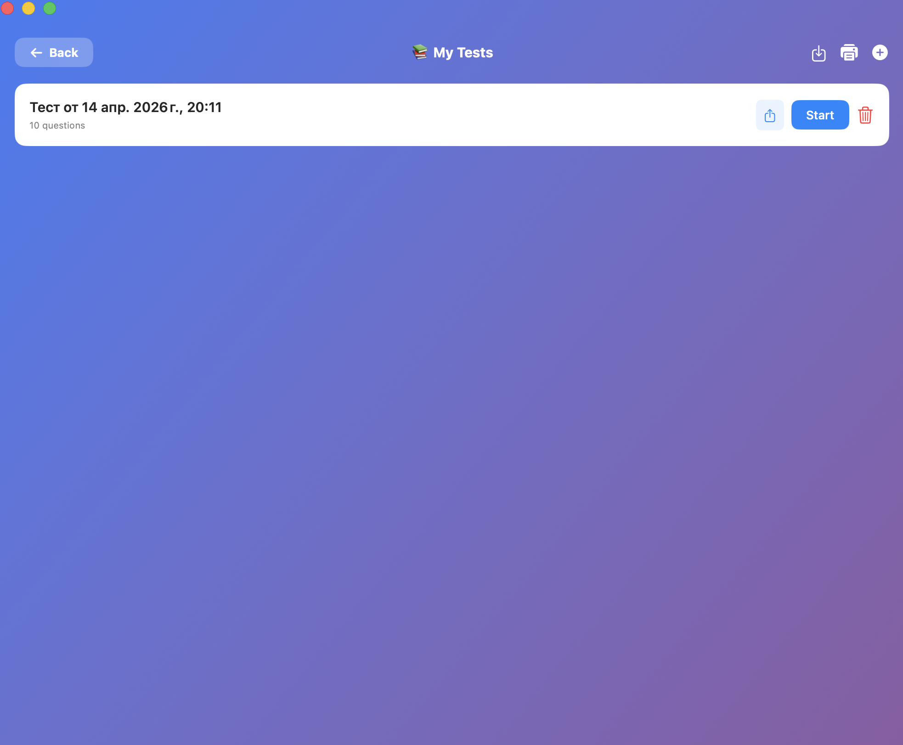
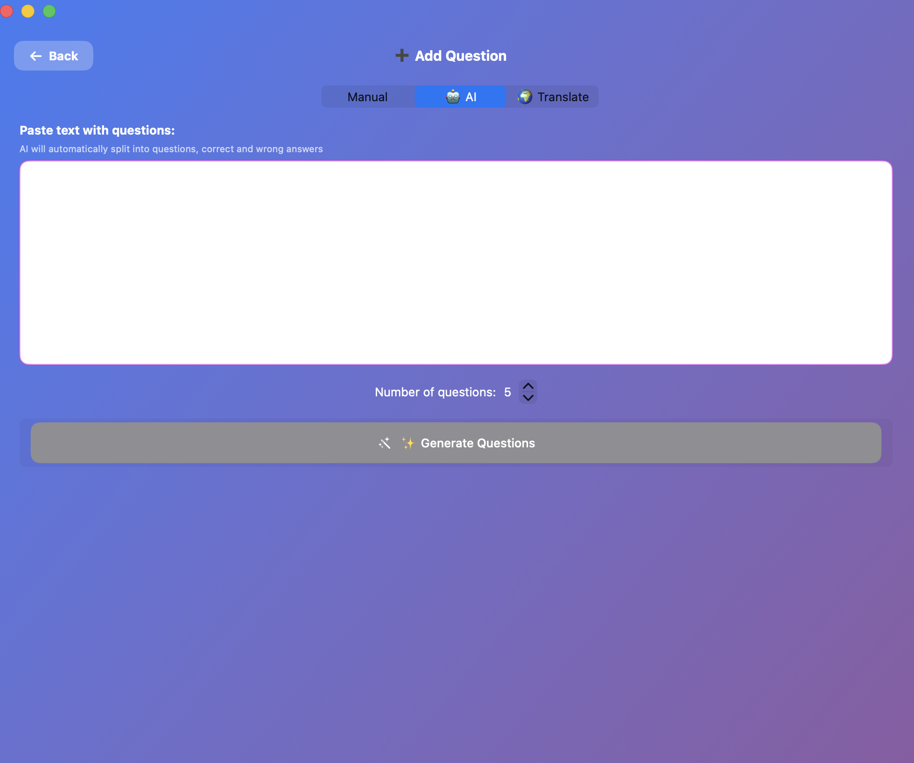
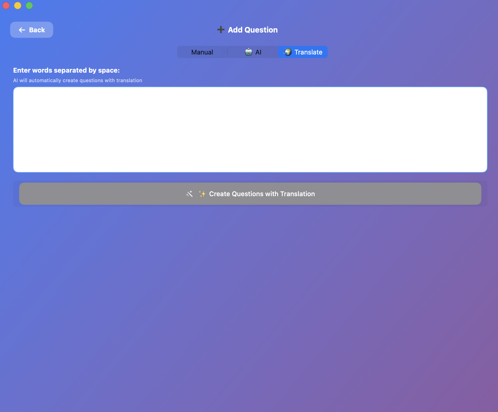
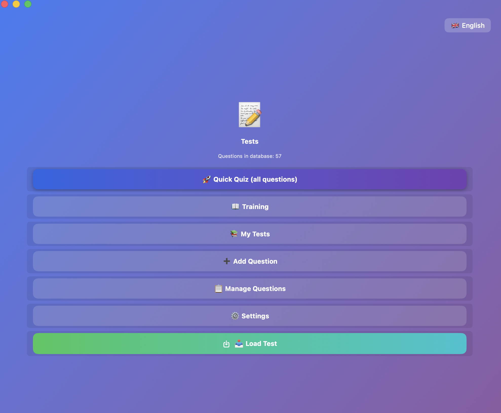
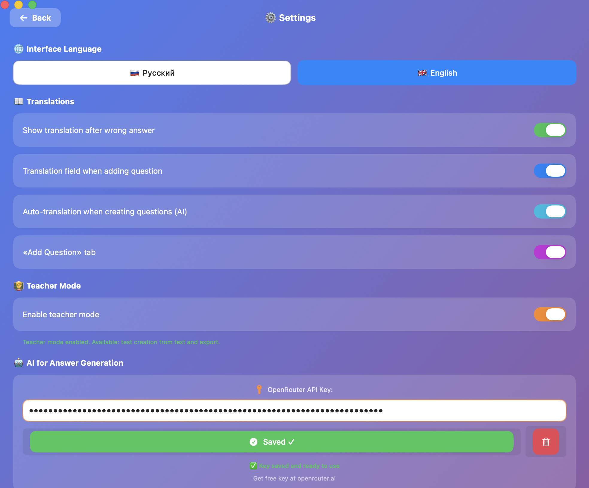

# 📝 QuizApp

Нативное macOS-приложение для подготовки к тестам и контрольным работам.


## 🇷🇺 Русский

### Описание
QuizApp — это приложение для macOS, которое помогает готовиться к тестам и контрольным работам. Создавайте свои вопросы, добавляйте переводы и тренируйтесь в удобном режиме.

### ✨ Возможности

- **🚀 Быстрый тест** — прохождение теста из всех ваших вопросов в случайном порядке
- **📖 Тренировка** — режим для изучения вопросов с переводами
  - Показывает вопрос и ответ с переводом на русский
  - Навигация вперёд и назад по вопросам
  - Вопросы перемешиваются при каждом запуске
  - Выбор конкретных вопросов для тренировки
- **➕ Добавление вопросов** — три режима:
  - **Вручную** — создание вопросов вручную
  - **🤖 ИИ** — генерация вопросов из текста (можно выбрать количество 1-20)
  - **🌍 Перевод** — генерация вопросов с переводом из слов через пробел
- **📚 Мои тесты** — создание и управление тестами
  - Печать тестов с выбором языка инструкции (EN/RU)
  - Варианты ответов a), b), c), d)
  - Экспорт тестов в .json для студентов
  - Загрузка тестов из файла
- **👨‍🏫 Режим учителя** — дополнительные функции:
  - Загрузка тестов из .json файлов
  - Печать тестов
  - Экспорт тестов для студентов
- **🤖 ИИ-генерация** — автоматическая генерация вопросов и ответов с помощью ИИ
- **📋 Управление вопросами** — просмотр, удаление и сброс вопросов
- **🌐 Два языка** — русский и английский интерфейс
- **📖 Переводы** — показ перевода вопроса и ответа после неправильного ответа
- **⚙️ Настройки** — управление переводами, API ключом ИИ, языком и режимом учителя

### 📸 Скриншоты (Русский)

| Главное меню | ИИ генерация | Перевод |
|---|---|---|
|  |  |  |

| Мои тесты | Печать | Настройки |
|---|---|---|
|  |  |  |

---

## 🇬🇧 English

### Description
QuizApp is a native macOS application that helps you prepare for tests and quizzes. Create your own questions, add translations, and practice in a convenient mode.

### ✨ Features

- **🚀 Quick Quiz** — take a test with all your questions in random order
- **📖 Training** — mode for studying questions with translations
  - Shows question and answer with translation
  - Forward and backward navigation
  - Questions are shuffled each time
  - Select specific questions for training
- **➕ Add Questions** — three modes:
  - **Manual** — create questions manually
  - **🤖 AI** — generate questions from text (select 1-20 questions)
  - **🌍 Translate** — generate questions with translation from words separated by space
- **📚 My Tests** — create and manage tests
  - Print tests with language selection (EN/RU)
  - Answer options a), b), c), d)
  - Export tests as .json for students
  - Import tests from file
- **👨‍🏫 Teacher Mode** — additional features:
  - Import tests from .json files
  - Print tests
  - Export tests for students
- **🤖 AI Generation** — automatic question and answer generation using AI
- **📋 Manage Questions** — view, delete and reset questions
- **🌐 Two Languages** — Russian and English interface
- **📖 Translations** — show translations after wrong answers
- **⚙️ Settings** — manage translations, AI API key, language and teacher mode

### 📸 Screenshots (English)

| Main Menu | AI Generation | Translate |
|---|---|---|
|  |  |  |

| My Tests | Print | Settings |
|---|---|---|
|  |  |  |

---

### 🛠 Установка на macOS / Installation on macOS

#### Способ 1: Готовое приложение / Method 1: Pre-built App
1. Скачайте `QuizApp.app` из папки [`macOS/`](macOS/) или раздела [Releases](https://github.com/NoYm3s/QuizApp/releases)
2. Переместите в папку `Программы` (Applications)
3. Откройте приложение двойным кликом

#### Способ 2: Сборка из исходного кода / Method 2: Build from Source
```bash
# Требуется Xcode Command Line Tools
xcode-select --install

# Клонирование репозитория
git clone https://github.com/NoYm3s/QuizApp.git
cd QuizApp/macOS

# Компиляция
swiftc -parse-as-library -o QuizApp main.swift

# Создание .app пакета
mkdir -p QuizApp.app/Contents/MacOS
mkdir -p QuizApp.app/Contents/Resources
cp QuizApp QuizApp.app/Contents/MacOS/
cp Info.plist QuizApp.app/Contents/
cp applet.icns QuizApp.app/Contents/Resources/

# Подписание
codesign --force --deep --sign - QuizApp.app
```

### 🤖 Настройка ИИ / AI Setup
Для генерации вопросов с помощью ИИ:
1. Зарегистрируйтесь на [openrouter.ai](https://openrouter.ai)
2. Создайте API ключ в разделе Keys
3. В приложении: Настройки → Введите API ключ → Сохранить

### 📁 Структура проекта / Project Structure
```
QuizApp/
├── macOS/
│   ├── main.swift          # Исходный код
│   └── QuizApp.app         # Готовое приложение
├── Windows/
│   └── quiz.html           # HTML версия
├── screenshots/
│   ├── ru/                 # Скриншоты на русском
│   └── en/                 # Скриншоты на английском
├── logo.png                # Логотип
└── README.md               # Этот файл
```

---

## 🪟 Windows Version

Для Windows доступна HTML-версия приложения. Откройте `Windows/quiz.html` в любом браузере.

---

## 📄 License

MIT License
