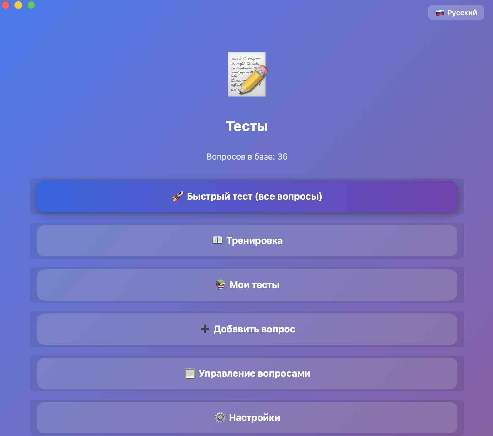
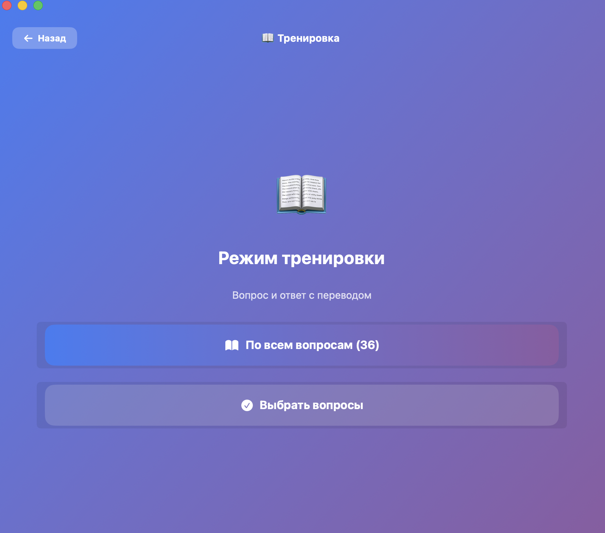
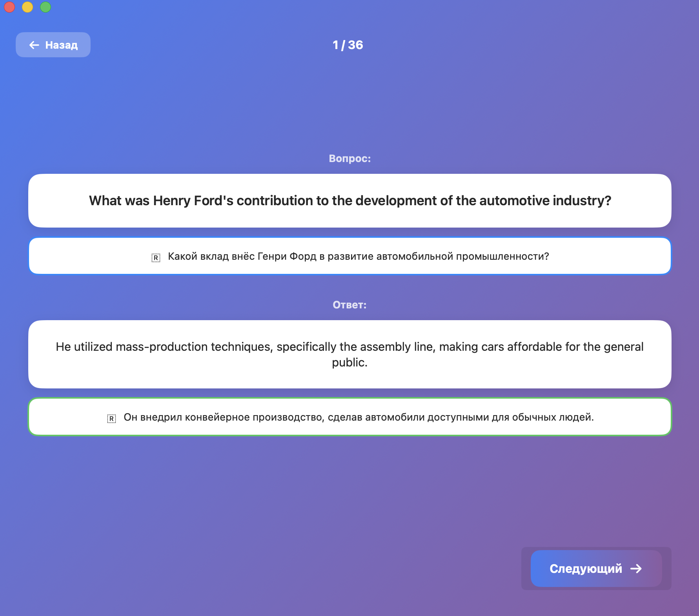
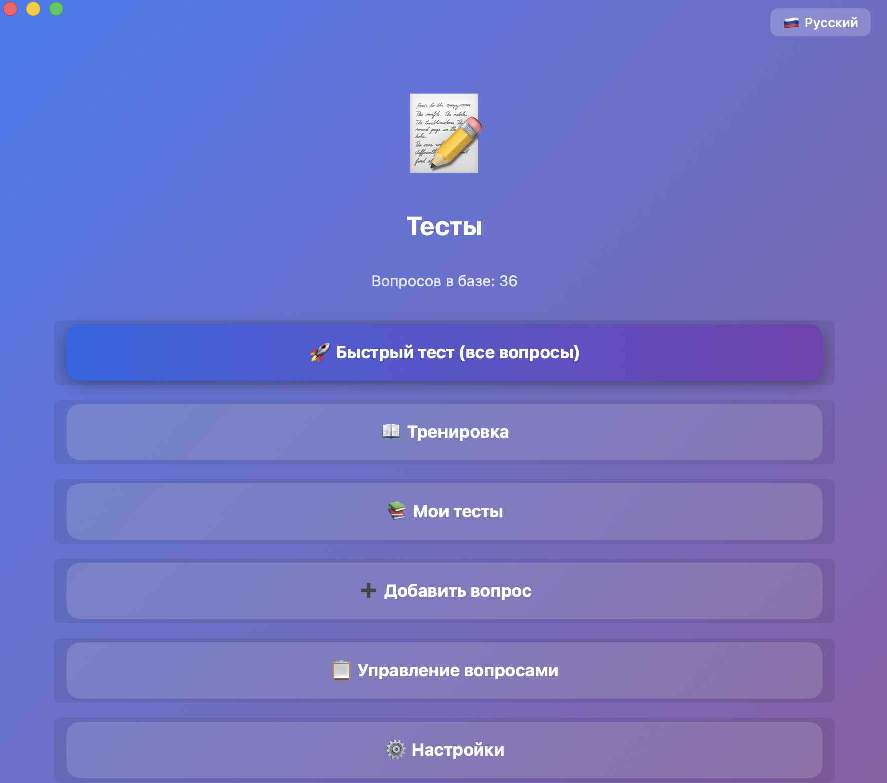
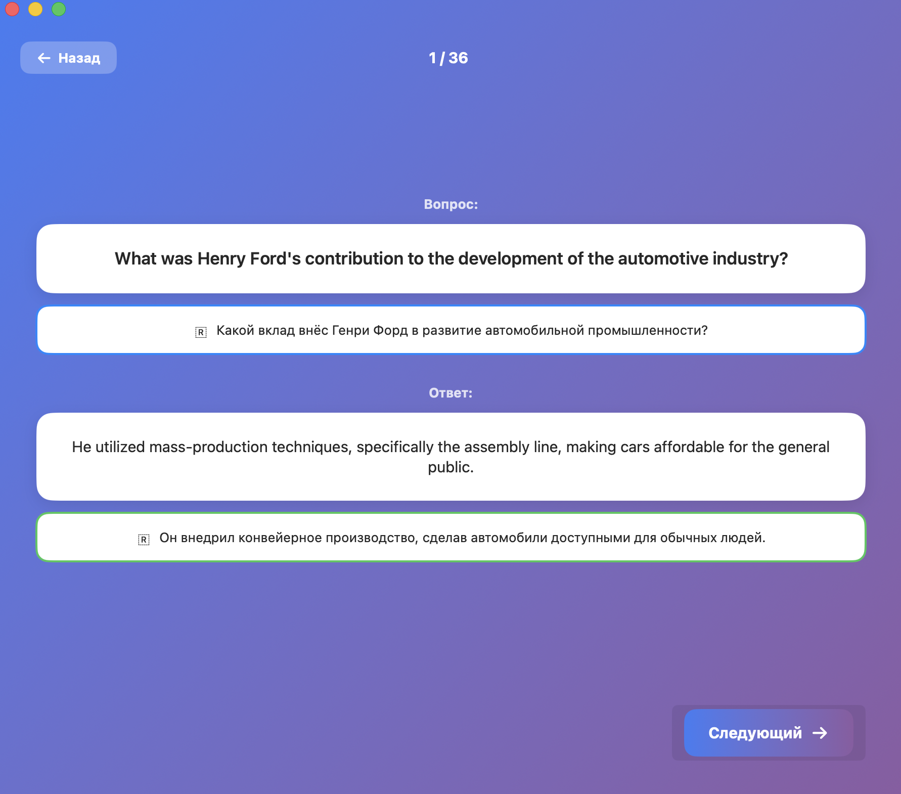
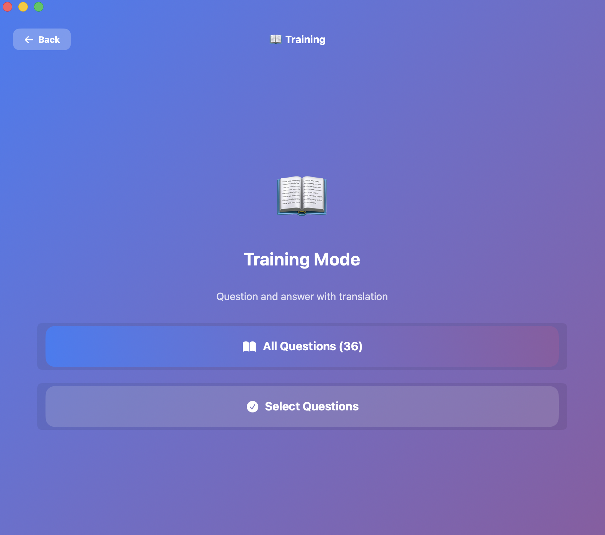

# 📝 QuizApp

Нативное macOS-приложение для подготовки к тестам и контрольным работам.


## 🇷 Русский

### Описание
QuizApp — это приложение для macOS, которое помогает готовиться к тестам и контрольным работам. Создавайте свои вопросы, добавляйте переводы и тренируйтесь в удобном режиме.

### ✨ Возможности

- **🚀 Быстрый тест** — прохождение теста из всех ваших вопросов в случайном порядке
- **📖 Тренировка** — новый режим для изучения вопросов с переводами
  - Показывает вопрос и ответ с переводом на русский
  - Навигация вперёд и назад по вопросам
  - Вопросы перемешиваются при каждом запуске
  - Выбор конкретных вопросов для тренировки
- **➕ Добавление вопросов** — создание своих вопросов с:
  - Вопросом на английском
  - Правильным ответом
  - Тремя неправильными вариантами
  - Переводами вопроса и ответа на русский (опционально)
- **🤖 ИИ-генерация** — автоматическая генерация неправильных ответов с помощью ИИ (Qwen 2.5 через OpenRouter)
- **📋 Управление вопросами** — просмотр, удаление и сброс вопросов
- **🌐 Два языка** — русский и английский интерфейс
- **📖 Переводы** — показ перевода вопроса и ответа после неправильного ответа в тесте
- **⚙️ Настройки** — управление переводами, API ключом ИИ и языком

### 📸 Скриншоты (Русский)

| Главное меню | Тренировка | Режим тренировки |
|---|---|---|
|  |  |  |

| Добавить вопрос | Настройки | Управление |
|---|---|---|
|  |  |  |

### 📸 Скриншоты (English)

| Main Menu | Training | Training Mode |
|---|---|---|
|  |  |  |

| Add Question | Settings | Manage |
|---|---|---|
|  |  |  |

### 🛠 Установка на macOS

#### Способ 1: Готовое приложение
1. Скачайте `QuizApp.app` из папки [`macOS/`](macOS/) или раздела [Releases](https://github.com/NoYm3s/QuizApp/releases)
2. Переместите в папку `Программы` (Applications)
3. Откройте приложение двойным кликом

#### Способ 2: Сборка из исходного кода
```bash
# Требуется Xcode Command Line Tools
xcode-select --install

# Клонирование репозитория
git clone https://github.com/NoYm3s/QuizApp.git
cd QuizApp/macOS

# Компиляция
swiftc -parse-as-library -o QuizApp_Binary main.swift -framework SwiftUI -framework AppKit

# Создание .app пакета
mkdir -p QuizApp.app/Contents/MacOS
mkdir -p QuizApp.app/Contents/Resources
cp QuizApp_Binary QuizApp.app/Contents/MacOS/QuizApp

# Подписание
codesign --force --deep --sign - QuizApp.app

# Запуск
open QuizApp.app
```

### 🤖 Настройка ИИ
Для генерации неправильных ответов с помощью ИИ:
1. Зарегистрируйтесь на [openrouter.ai](https://openrouter.ai)
2. Создайте API ключ в разделе Keys
3. В приложении: Настройки → Введите API ключ → Сохранить

### 📁 Структура проекта
```
QuizApp/
├── macOS/
│   ├── main.swift          # Исходный код macOS приложения
│   └── QuizApp.app         # Готовое приложение
├── Windows/
│   └── quiz.html           # HTML версия для Windows
├── screenshots/
│   ├── ru/                 # Скриншоты на русском
│   └── en/                 # Скриншоты на английском
├── logo.png                # Логотип приложения
└── README.md               # Этот файл
```

---

## 🇬🇧 English

### Description
QuizApp is a native macOS application that helps you prepare for tests and quizzes. Create your own questions, add translations, and practice in a convenient mode.

### ✨ Features

- **🚀 Quick Quiz** — take a test with all your questions in random order
- **📖 Training** — new mode for studying questions with translations
  - Shows question and answer with Russian translation
  - Forward and backward navigation
  - Questions are shuffled each time
  - Select specific questions for training
- **➕ Add Questions** — create your own questions with:
  - Question in English
  - Correct answer
  - Three wrong options
  - Question and answer translations to Russian (optional)
- **🤖 AI Generation** — automatic wrong answer generation using AI (Qwen 2.5 via OpenRouter)
- **📋 Manage Questions** — view, delete and reset questions
- **🌐 Two Languages** — Russian and English interface
- **📖 Translations** — show question and answer translations after wrong answers in quiz
- **⚙️ Settings** — manage translations, AI API key and language

### 🛠 Installation on macOS

#### Method 1: Pre-built App
1. Download `QuizApp.app` from [`macOS/`](macOS/) folder or [Releases](https://github.com/NoYm3s/QuizApp/releases)
2. Move to `Applications` folder
3. Open the app by double-clicking

#### Method 2: Build from Source
```bash
# Requires Xcode Command Line Tools
xcode-select --install

# Clone repository
git clone https://github.com/NoYm3s/QuizApp.git
cd QuizApp/macOS

# Compile
swiftc -parse-as-library -o QuizApp_Binary main.swift -framework SwiftUI -framework AppKit

# Create .app bundle
mkdir -p QuizApp.app/Contents/MacOS
mkdir -p QuizApp.app/Contents/Resources
cp QuizApp_Binary QuizApp.app/Contents/MacOS/QuizApp

# Sign
codesign --force --deep --sign - QuizApp.app

# Run
open QuizApp.app
```

### 🤖 AI Setup
To generate wrong answers using AI:
1. Register at [openrouter.ai](https://openrouter.ai)
2. Create an API key in the Keys section
3. In the app: Settings → Enter API key → Save

### 📁 Project Structure
```
QuizApp/
├── macOS/
│   ├── main.swift          # macOS app source code
│   └── QuizApp.app         # Pre-built application
├── Windows/
│   └── quiz.html           # HTML version for Windows
├── screenshots/
│   ├── ru/                 # Russian screenshots
│   └── en/                 # English screenshots
├── logo.png                # App logo
└── README.md               # This file
```

---

## 🪟 Windows Version

Для Windows доступна HTML-версия приложения. Откройте `Windows/quiz.html` в любом браузере.

For Windows, an HTML version is available. Open `Windows/quiz.html` in any browser.

---

## 📄 License

MIT License
